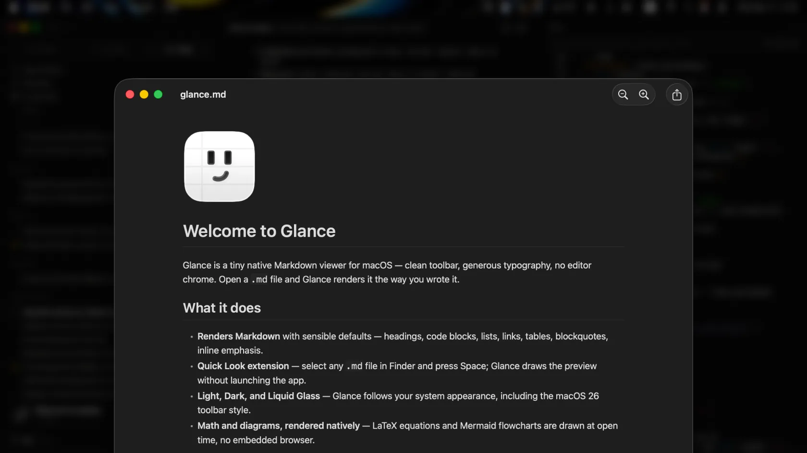
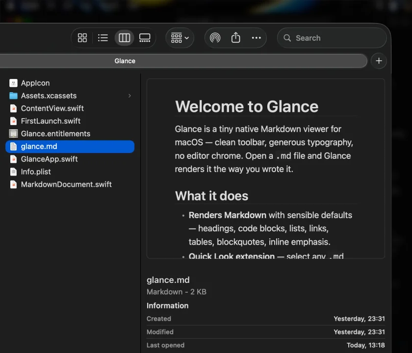
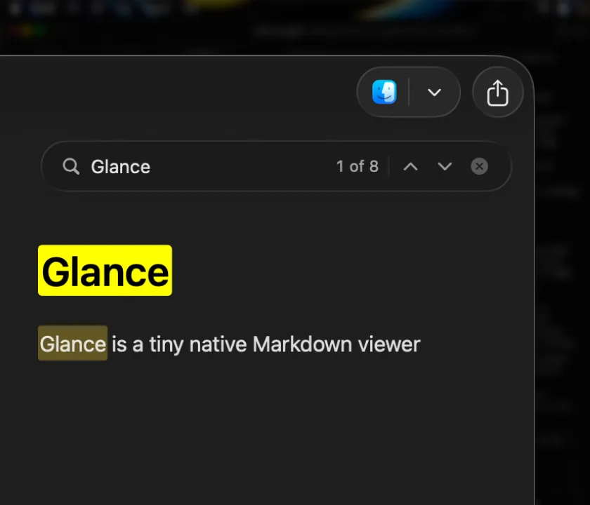
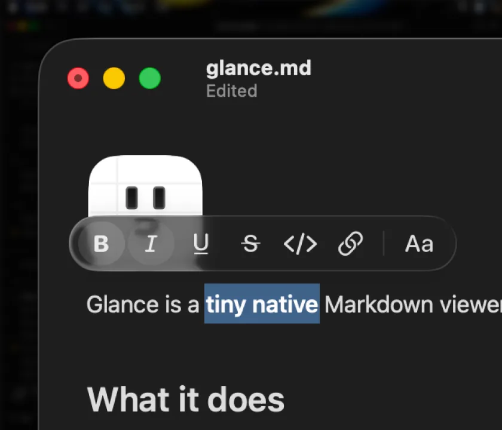
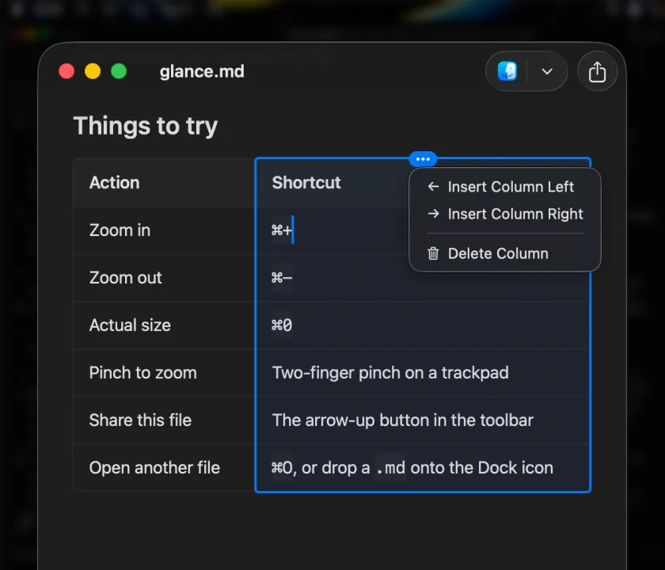
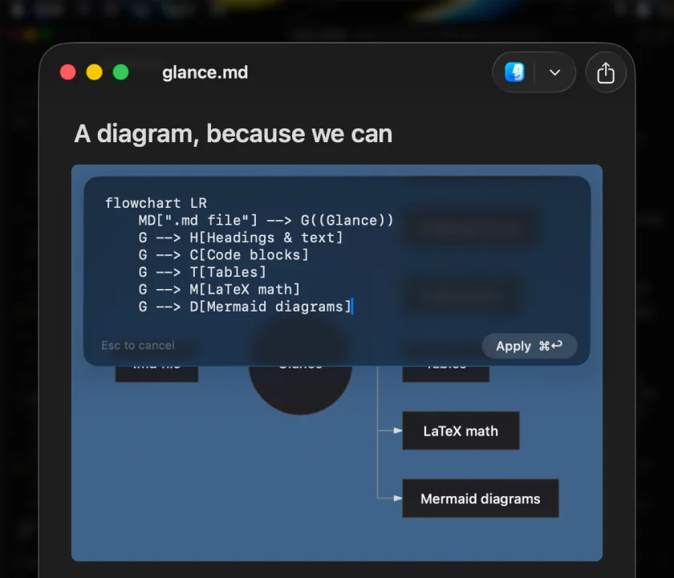

# Glance

**A native Markdown viewer and Quick Look extension for macOS.**

Press Space in Finder and your `.md` file renders — math, diagrams, tables and all.
No Electron, no WebView, no waiting.

[**Download for macOS**](https://github.com/maging-studio/glance/releases/latest) ·
[glance.md](https://glance.md) ·
[Changelog](https://glance.md/changelog)

---

## Install

Download the latest `.dmg` from [Releases](https://github.com/maging-studio/glance/releases/latest)
or from [glance.md](https://glance.md), open it, and drag Glance to Applications.

The build is signed with a Developer ID and notarized by Apple, so it opens
without a Gatekeeper warning. Updates arrive over the air.

**Requirements:** macOS 14 (Sonoma) or later. One universal binary for Apple
Silicon and Intel.

## What it does

**Quick Look, done properly.** Select a `.md` file in Finder, press Space, and
read it. The preview is the same renderer the app uses, so a table looks like a
table and a formula looks like a formula.

**Math and diagrams, rendered natively.** LaTeX and Mermaid are drawn with Core
Graphics at document open — no browser engine, and nothing is fetched from a CDN
to typeset them. Glance only reaches the network to check for updates and to
load images your document points at over `http(s)`.

**Syntax highlighting** for fenced code blocks, and whole-file JSON and YAML get
pretty-printed and colored. A 15 MB JSON file shows content in about a third of
a second.

**Find in file** with ⌘F, every match highlighted.

**Smart zoom** — pinch to zoom around the pointer, not the window center.

**Print and export to PDF** (⌘P / ⇧⌘E), paginated on real block boundaries so
lines, table rows and diagrams never get sliced in half.

## Editing — Glance Pro

Reading is free forever, with no account to create. Editing is a one-time
**$9.99** license with a **14-day trial**, no card needed.

Click any block in the rendered page and type. There is no separate edit mode
and no source pane — you are formatting the document you are reading.

- **Inline formatting** — select text, pick a style
- **Tables** — edit cells in place, insert and delete columns
- **Diagrams** — tweak the Mermaid source over the diagram, ⌘↩ to re-render
- **Callouts, task lists, code blocks** — all editable in place

[Buy a license](https://glance.md/buy) · [How Pro works](https://glance.md/#pro)

## Issues and requests

This repository is where Glance is tracked publicly. Bug reports and feature
requests are welcome in [Issues](https://github.com/maging-studio/glance/issues) —
they get read, and they have shipped: find-in-file, ⌘N, and PDF export all
started as user mail.

The app's source is not open, but every release lands here with its notarized
DMG and its notes.

## Links

| | |
|---|---|
| Website | [glance.md](https://glance.md) |
| Changelog | [glance.md/changelog](https://glance.md/changelog) |
| Privacy | [glance.md/privacy](https://glance.md/privacy) |
| Buy a license | [glance.md/buy](https://glance.md/buy) |
| Releases | [github.com/maging-studio/glance/releases](https://github.com/maging-studio/glance/releases) |

Built by [Maging Studio](https://github.com/maging-studio).
